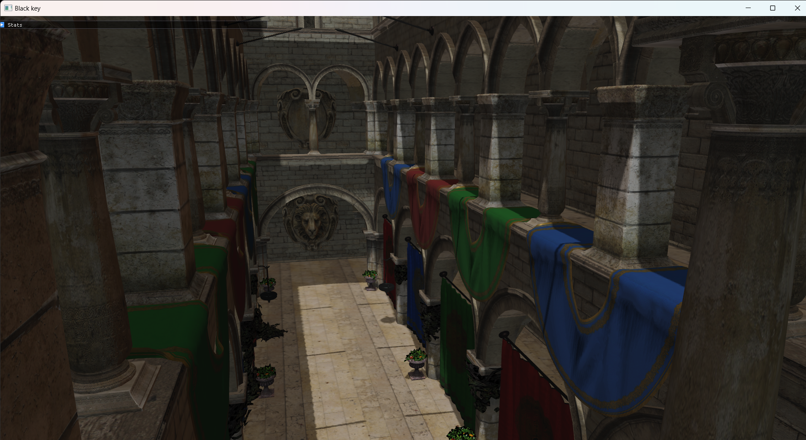

# Black Key

A realtime rendering engine leveraging modern vulkan and C++ features built as a research project.

All the following scenes are rendered in engine:

## Currently supported features

# Graphics
* Physically based rendering using a cook-torrence brdf
* Image based lighting
* Cascaded shadow maps + PCF filtering
* GLTF loading suppport via Fastgltf
* Early depth testing via Z-prepass
* HDR + options for Filmic/Uncharted/unreal tonemappers
* CPU side Frustum culling
* Multisampling anti-aliasing
* normal mapping
* Ktx Texture support for skybox
* Transparency

# API Features
* Buffer device addressing and programmable vertex pulling
* Dynamic Rendering

##  Roadmap
* [ ] Clustered forward shading
* [ ] GPU driven rendering
* [ ] Move Frustum culling to a compute shader
* [ ] occlusion culling
* [ ] Bindless Resources
* [ ] Bloom
* [ ] HBAO/GTAO/SSAO
* [ ] Async compute
* [ ] Global illumination(SSGI(HBIL/SSIL)/Voxel GI/RSM/Deep G-buffers/light propagation volumes)
* [ ] Render graph
* [ ] shader hot reloading
* [ ] editor

