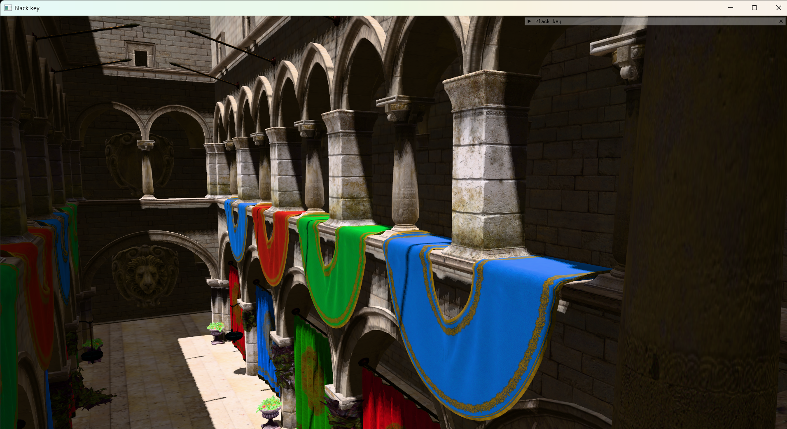

# Black Key


A realtime rendering engine written in modern c++ and vulkan built as a research project.

All the following scenes are rendered in engine:


*3000 point lights rendered on a 2016 intel laptop IGPU at 30 fps thanks to clustered forward shading*




*PBR inspired by filament and with a disney diffuse brdf*


# Currently supported features

## Graphics
* Clustered forward shading using compute shaders for light culling
* GPU frustum and occlusion culling via compute shaders
* GPU Driven rendering and bindless pipelines
* Physically based rendering using a cook-torrence brdf
* Image based lighting
* Cascaded shadow maps + PCF filtering
* GLTF loading support via Fastgltf
* Early depth testing/Z-prepass
* Normal mapping
* Ktx Texture loading support
* Transparency
* FXAA + MSAA
* HDR + options for Filmic/Uncharted/unreal tonemappers
* Physically based bloom implemented using compute shaders


## API Features
* Buffer device addressing allowing programmable vertex pulling
* Dynamic Rendering
* Bindless resources via descriptor indexing
* Multi Draw indirect

##  Roadmap
* [x] occlusion culling
* [x] Bloom
* [ ] HBAO/GTAO/SSAO

## Things to look into
* Render Graph
* Async compute

# Build Instructions

## Requirements
* [Cmake](https://cmake.org/) version 3.12 or newer
* C++ 20
* GPU with support for vulkan 1.3

## Instructions
To setup the repo:

```
    git clone https://github.com/Silver-will/Black_Key.git --recursive
    cd Black_key
```
If you don't clone recursively for some reason you can always 

``` 
    git submodule update --init --recursive
```

Then run the following to build with cmake

```
   mkdir build
   cd build
   cmake .. -DCMAKE_BUILD_TYPE=Debug
   cmake --build .
```